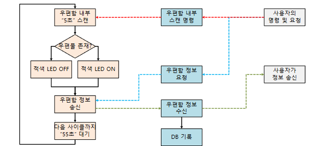

# IOT-우편함 프로젝트(Iot-Mailbox) :mailbox:

## 프로젝트 개요 :mailbox_with_no_mail:
- 기존 우편함은 사용자가 직접 가서 육안으로 확인해야 하는 물리적 제약, 번거로움과 
같은 불편함이 있으므로 그 부분을 해소하기 위해 초음파 센서와 LED, 
Bluetooth 및 Wi-Fi 통신 기술을 결합하여 우편물의 유무를 실시간으로 감지하고 
사용자에게 직관적으로 알리는 시스템을 구현했습니다. 
---
## 수행기간 :hourglass_flowing_sand:
  2024.11.23. ~ 2024.11.27

---
## 개발목표 :mailbox_with_mail:
- 초음파 센서 이용해 우편물의 유무를 자동으로 감지 후, 서버를 통헤 사용자에게 우편물 유무정보를 전달
- LED와 간단한 네트워크 시스템을 통해 우편물 상태 확인
- ~~DB 연동을 통해 우편물 상태 데이터를 저장하고 감지된 우편의 이용자만에게 정보 전달~~

---
## 기술 스택
  ### H/W
- 우편물 유/무: 초음파센서
- LED
- 택트 스위치
- WiFi/Bluetooth 모듈
- Arduino
- STM32F411RE
- Raspberry Pi
---
  ### S/W
- C언어
- STM32CudeIDE
- MariaDB
- Linux(우분투 기반)
---
## 시스템 구성도

---
## 플로우차트

## 프리젠테이션 자료
- [PDF/PPTX](https://drive.google.com/drive/folders/1rT0-xPw2Uloa-9_ssn0xoSnl8zNQHqia?usp=sharing)
